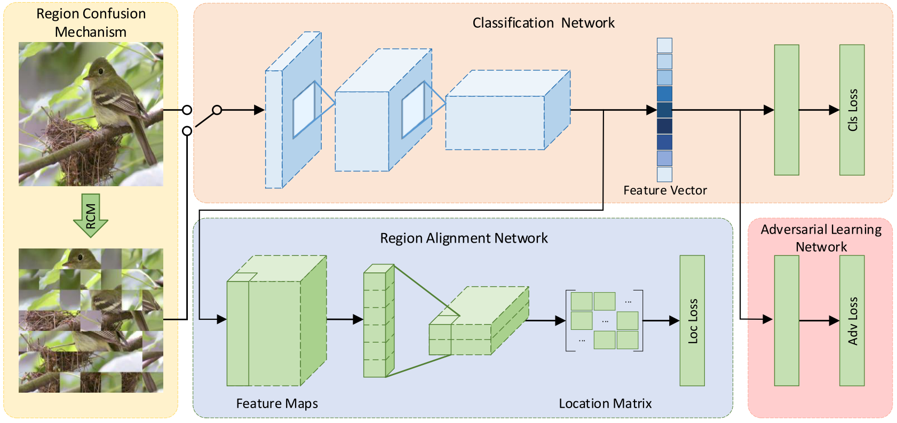
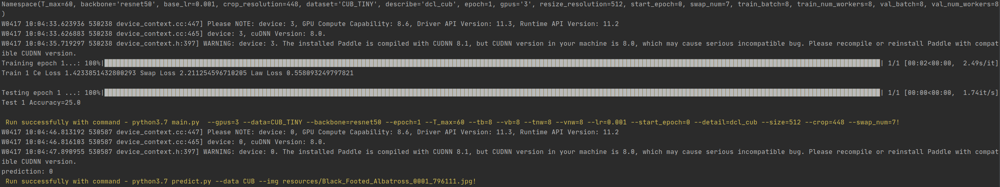

# 基于 PaddlePaddle 实现 DCL （CVPR2019）

* [基于 PaddlePaddle 实现 DCL （CVPR2019）](#基于-paddlepaddle-实现-dcl-cvpr2019)
  * [1\. 简介](#1-简介)
  * [2\. 数据集和复现精度](#2-数据集和复现精度)
    * [数据集信息](#数据集信息)
    * [复现精度](#复现精度)
  * [3\. 准备环境](#3-准备环境)
  * [4\. 快速开始](#4-快速开始)
    * [4\.1 下载数据集](#41-下载数据集)
    * [4\.2 下载本项目及训练权重](#42-下载本项目及训练权重)
    * [4\.3 训练模型](#43-训练模型)
    * [4\.4 验证模型](#44-验证模型)
    * [4\.5 模型预测](#45-模型预测)
  * [5\. 项目结构](#5-项目结构)
  * [6\. TIPC](#6-tipc)
  * [7\. 参考及引用](#7-参考及引用)


## 1. 简介

Destruction and Construction Learning for Fine-grained Image Recognition 提出了一种破坏重建式的细粒度图像分类方法，引入“破坏和构造”流以“破坏”与“重建”图像，学习区分区域和特征。“破坏”学习，将输入图像划分为局部区域，然后通过**区域混淆机制（RCM）**打乱重组。 RCM引入的噪声使用**对抗损失**进行补偿。 “构造”学习中的**区域对齐网络**恢复局部区域的原始空间布局，对局部区域之间的语义相关性进行建模。通过联合训练和参数共享，DCL为分类网络注入了更多可区分的局部细节。整体框架如下：



- **原论文**：[Destruction and Construction Learning for Fine-grained Image Recognition](https://openaccess.thecvf.com/content_CVPR_2019/papers/Chen_Destruction_and_Construction_Learning_for_Fine-Grained_Image_Recognition_CVPR_2019_paper.pdf).

- **官方原版代码**（基于PyTorch）[DCL](https://github.com/JDAI-CV/DCL).

## 2. 数据集和复现精度

### 数据集信息

| 数据集                                                       | 物体 | 类别数 | 训练 | 测试 |
| ------------------------------------------------------------ | ---- | ------ | ---- | ---- |
| [CUB-200-2011](http://www.vision.caltech.edu/visipedia/CUB-200-2011.html) | 鸟   | 200    | 5994 | 5794 |
| [Stanford-Cars](https://ai.stanford.edu/~jkrause/cars/car_dataset.html) | 汽车 | 196    | 8144 | 8041 |
| [FGVC-Aircraft](http://www.robots.ox.ac.uk/~vgg/data/fgvc-aircraft/) | 飞机 | 100    | 6667 | 3333 |

### 复现精度

| 数据集        | 网络      | 原文精度 | 复现精度  |
| ------------- | --------- | -------- | --------- |
| CUB200-2011   | ResNet-50 | 87.8     | **87.83** |
| Stanford Cars | ResNet-50 | 94.5     | **94.54** |
| FGVC-Aircraft | ResNet-50 | 93.0     | **93.46** |

- 官方的代码中，数据集划分成了训练集、验证集和测试集，但是数据集本身没有验证集，因此复现过程中，删去了验证集的划分
- 官方代码中，`datasets`文件夹下给出了训练集和测试集的图片路径和对应标签（从1开始），但是数据集读取部分是从0开始，所以需要这些文件中标签都要减1。复现后的版本已经做了修正。
- 由于论文和官方代码有些参数配置不一样，如论文中跑180个epoch，代码是360个epoch。论文中并没有提供学习率和batch size等参数，在实现时根据经验将初始学习率设置为0.001，batch size设置为8，最终在前90个epoch内达到目标精度。
- 本项目（基于 PaddlePaddle ）在三个数据集上的结果在上表列出。由于训练时设置了随机数种子，理论上是可复现的。但在反复重跑几次发现结果还是会有波动，说明算法的随机性仍然存在，尚未找到解决方法，但是基本上最终正确率差别不大。


## 3. 准备环境

环境配置：

- Python: 3.7
- [PaddlePaddle](https://www.paddlepaddle.org.cn/documentation/docs/en/install/index_en.html): 2.2.2
- 硬件：NVIDIA 3090Ti

python库：

- numpy: 1.20.3
- pandas: 1.2.4
- Pillow: 8.2.0
- tqdm: 4.60.0 


## 4. 快速开始

### 4.1 下载数据集

请到官网下载好数据集，并修改main函数中`LoadConfig`中的数据集图片路径

### 4.2 下载本项目及训练权重

```sh
git clone https://github.com/zzc98/PaddlePaddle_DCL.git
```

paddle的resnet官方权重：[resnet50](https://paddle-hapi.bj.bcebos.com/models/resnet50.pdparams)，并修改main函数中`LoadConfig`中的预训练权重地址。

复现好的训练权重和日志下载链接：[百度网盘](https://pan.baidu.com/s/1e8qPvFztSAzNS-g8h-4BeQ )，提取码：8o49。

### 4.3 训练模型

`cub`数据集运行以下命令：

```sh
python main.py \
--gpus=0 \
--data=CUB \
--backbone=resnet50 \
--epoch=90 \
--T_max=60 \
--tb=8 \
--vb=8 \
--tnw=8 \
--vnw=8 \
--lr=0.001 \
--start_epoch=0 \
--detail=dcl_cub \
--size=512 \
--crop=448 \
--swap_num=7
```

`car`数据集运行以下命令：

```sh
python main.py \
--gpus=0 \
--data=STCAR \
--backbone=resnet50 \
--epoch=100 \
--T_max=90 \
--tb=8 \
--vb=8 \
--tnw=8 \
--vnw=8 \
--lr=0.001 \
--start_epoch=0 \
--detail=dcl_car \
--size=512 \
--crop=448 \
--swap_num=7
```

`aircraft`数据集运行以下命令：

```sh
python main.py \
--gpus=0 \
--data=AIR \
--backbone=resnet50 \
--epoch=100 \
--T_max=90 \
--tb=8 \
--vb=8 \
--tnw=8 \
--vnw=8 \
--lr=0.001 \
--start_epoch=0 \
--detail=dcl_air \
--size=512 \
--crop=448 \
--swap_num=2
```

### 4.4 验证模型

运行以下命令：

```sh
python test.py --gpus=0 --data=CUB --pdparams=./outputs/CUB/checkpoints/dcl_cub-20220416-183150.pdparams --vb=8 --vnw=8 --size=512 --swap_num=7
python test.py --gpus=0 --data=STCAR --pdparams=./outputs/STCAR/checkpoints/dcl_car-20220416-100532.pdparams --vb=8 --vnw=8 --size=512 --swap_num=7
python test.py --gpus=0 --data=AIR --pdparams=./outputs/AIR/checkpoints/dcl_air-20220416-100902.pdparams --vb=8 --vnw=8 --size=512 --swap_num=2
```

### 4.5 模型预测

运行以下命令完成单张图片的类别预测：

```sh
python predict.py --data CUB --img resources/Black_Footed_Albatross_0001_796111.jpg --pdparams=./outputs/CUB/checkpoints/dcl_cub-20220416-183150.pdparams
```

## 5. 项目结构

```
PaddlePaddle_DCL
├─datasets	# 数据集图片路径和标签对应关系
│  ├─AIR
│  │      test.txt
│  │      train.txt 
│  ├─CUB
│  │      test.txt
│  │      train.txt
│  ├─CUB_TINY
│  │      test.txt
│  │      train.txt
│  └─STCAR
│          test.txt
│          train.txt
├─models
│      dcl.py	# DCL模型定义，backbone是paddle官方的ResNet50
├─test_tipc	# TIPC配置
├─outputs	# 日志及模型文件
├─utils
|        dataset.py	# 数据集组织与读取
|        eval_model.py	# 验证模型性能
|        train_model.py	# 模型训练
|        transforms.py	# DCL机制实现
|        utils.py	# 辅助训练函数
│  main.py	# 训练函数
|  predict.py	# 预测单张图片
│  run.sh 	# 训练脚本
└─ test.py	# 测试函数
```

## 6. TIPC

我们构造了一个小数据集`CUBTINY`用于TIPC。以Linux基础训练推理测试为例，测试流程如下。

在项目根目录下，运行测试命令：

```sh
bash test_tipc/test_train_inference_python.sh test_tipc/configs/DCLNet/train_infer_python.txt lite_train_lite_infer
```

得到如下结果：



## 7. 参考及引用

```
@inproceedings{dcl,
	author = {Chen, Yue and Bai, Yalong and Zhang, Wei and Mei, Tao},
	booktitle = {Proceedings of the IEEE Conference on Computer Vision and Pattern Recognition},
	pages = {5157--5166},
	title = {{Destruction and Construction Learning for Fine-grained Image Recognition}},
	year = {2019}
}
```

- [PaddlePaddle](https://github.com/paddlepaddle/paddle)

最后，非常感谢百度举办的[飞桨论文复现挑战赛（第六期）](https://aistudio.baidu.com/aistudio/competition/detail/205/0/introduction)让本人对 PaddlePaddle 理解更加深刻。

