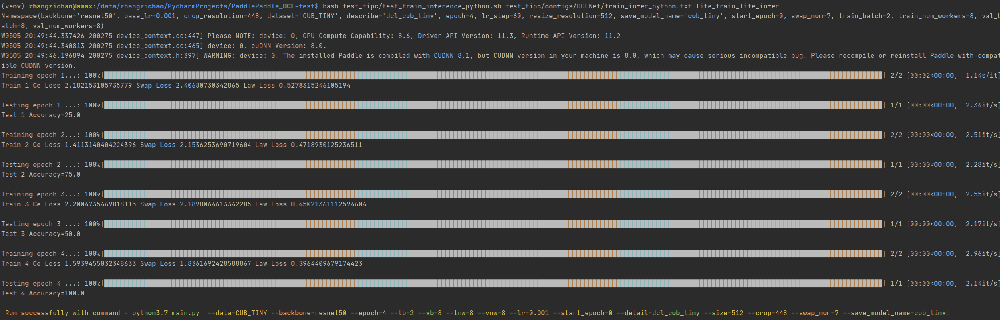

# 基于 PaddlePaddle 实现 DCL （CVPR2019）

* [基于 PaddlePaddle 实现 DCL （CVPR2019）](#基于-paddlepaddle-实现-dcl-cvpr2019)
  * [1\. 简介](#1-简介)
  * [2\. 数据集和复现精度](#2-数据集和复现精度)
    * [数据集信息](#数据集信息)
    * [复现精度](#复现精度)
  * [3\. 准备环境](#3-准备环境)
  * [4\. 快速开始](#4-快速开始)
    * [4\.1 下载数据集](#41-下载数据集)
    * [4\.2 下载本项目及训练权重](#42-下载本项目及训练权重)
    * [4\.3 训练模型](#43-训练模型)
    * [4\.4 验证模型](#44-验证模型)
    * [4\.5 模型预测](#45-模型预测)
  * [5\. 项目结构](#5-项目结构)
  * [6\. TIPC](#6-tipc)
  * [7\. 参考及引用](#7-参考及引用)


## 1. 简介

Destruction and Construction Learning for Fine-grained Image Recognition 提出了一种破坏重建式的细粒度图像分类方法，引入“破坏和构造”流以“破坏”与“重建”图像，学习区分区域和特征。“破坏”学习，将输入图像划分为局部区域，然后通过**区域混淆机制（RCM）**打乱重组。 RCM引入的噪声使用**对抗损失**进行补偿。 “构造”学习中的**区域对齐网络**恢复局部区域的原始空间布局，对局部区域之间的语义相关性进行建模。通过联合训练和参数共享，DCL为分类网络注入了更多可区分的局部细节。整体框架如下：


- **原论文**：[Destruction and Construction Learning for Fine-grained Image Recognition](https://openaccess.thecvf.com/content_CVPR_2019/papers/Chen_Destruction_and_Construction_Learning_for_Fine-Grained_Image_Recognition_CVPR_2019_paper.pdf).

- **官方原版代码**（基于PyTorch）[DCL](https://github.com/JDAI-CV/DCL).

## 2. 数据集和复现精度

### 数据集信息

| 数据集                                                       | 物体 | 类别数 | 训练 | 测试 |
| ------------------------------------------------------------ | ---- | ------ | ---- | ---- |
| [CUB-200-2011](http://www.vision.caltech.edu/visipedia/CUB-200-2011.html) | 鸟   | 200    | 5994 | 5794 |
| [Stanford-Cars](https://ai.stanford.edu/~jkrause/cars/car_dataset.html) | 汽车 | 196    | 8144 | 8041 |
| [FGVC-Aircraft](http://www.robots.ox.ac.uk/~vgg/data/fgvc-aircraft/) | 飞机 | 100    | 6667 | 3333 |

### 复现精度

| 数据集        | 网络      | 论文精度 | 验收标准 | 复现精度 |
| ------------- | --------- | -------- | ------------------ | ------------------- |
| CUB200-2011   | ResNet-50 | 87.8     | 87.35 | 87.40 |
| Stanford Cars | ResNet-50 | 94.5     | 94.3 | 94.3 |
| FGVC-Aircraft | ResNet-50 | 93.0（swap_num=2） | 91.6（swap_num=7） | 93.0（论文中swap_num=2）91.9（参考repo中swap_num=7） |

- 官方的代码中，数据集划分成了训练集、验证集和测试集，但是数据集本身没有验证集，因此复现过程中，删去了验证集的划分
- 官方代码中，`datasets`文件夹下给出了训练集和测试集的图片路径和对应标签（从1开始），但是数据集读取部分是从0开始，所以需要这些文件中标签都要减1。复现后的版本已经做了修正。
- 本项目（基于 PaddlePaddle ）在三个数据集上的结果在上表列出。由于训练时设置了随机数种子，理论上是可复现的。但在反复重跑几次发现结果还是会有波动，说明算法的随机性仍然存在，尚未找到解决方法，但是基本上最终正确率差别不大。


## 3. 准备环境

环境配置：

- Python: 3.7
- PaddlePaddle: 2.2.2
- 硬件：NVIDIA 3090

python库：

- numpy: 1.20.3
- pandas: 1.2.4
- Pillow: 8.2.0
- tqdm: 4.60.0 

## 4. 快速开始

### 4.1 下载数据集

请到官网下载好数据集，并修改main函数中`LoadConfig`中的数据集图片路径

### 4.2 下载本项目及训练权重

```sh
git clone https://github.com/zzc98/PaddlePaddle_DCL.git
```

paddle的resnet官方权重：[resnet50](https://paddle-hapi.bj.bcebos.com/models/resnet50.pdparams)，并修改main函数中`LoadConfig`中的预训练权重地址。

复现好的训练权重和日志下载链接：[百度网盘]( https://pan.baidu.com/s/1ydn-F-_-lBqEQx9NQKOM6w?pwd=x5gc )，提取码：x5gc 。

### 4.3 训练模型

训练时运行以下命令：

```sh
python -m paddle.distribututed.launch --gpus 0,1 main.py \
--data=CUB \
--backbone=resnet50 \
--epoch=360 \
--lr_step=60 \
--tb=8 \
--vb=8 \
--tnw=16 \
--vnw=16 \
--lr=0.0008 \
--start_epoch=0 \
--detail=dcl_cub \
--size=512 \
--crop=448 \
--swap_num=7
```

几点说明：

- `--data`的值只能是`CUB`、`STCAR`、`AIR`，分别对应三个数据集
- `--detail`用于说明配置，用于指定保存文件名
- 飞机数据集上，`--swap_num=7`和参考repo一致（参考repo并没有针对此数据集修改此参数），但是按照论文配置应为`--swap_num=2`，“复现精度”表中也给出了两种情况下的复现结果
- 我们由于环境原因，无法使用单卡训练达到论文中的batch。由于我们使用双卡，虽然batch（`--tb`和`--vb`）定义为8，实际是16。

### 4.4 验证模型

运行以下命令：

```sh
python test.py --gpus=0 --data=CUB --pdparams=./outputs/CUB/checkpoints/dcl_cub-20220422-143357.pdparams --vb=16 --vnw=16 --size=512
python test.py --gpus=0 --data=STCAR --pdparams=./outputs/STCAR/checkpoints/dcl_car-20220422-143728.pdparams --vb=16 --vnw=16 --size=512
python test.py --gpus=0 --data=AIR --pdparams=./outputs/AIR/checkpoints/dcl_air-20220421-122625.pdparams --vb=16 --vnw=16 --size=512
```

### 4.5 单张图片预测

运行以下命令完成单张图片的类别预测（我们给出的示例是我们构造的cub tiny，建议您先运行tipc脚本后再测试下面的命令，或者按需更改参数）：

```sh
python predict.py --data CUB_TINY --img resources/Black_Footed_Albatross_0001_796111.jpg --pdparams outputs/CUB_TINY/checkpoints/dcl_cub_tiny-cub_tiny.pdparams 
```


### 4.6 模型导出

训练模型的导出：

```sh
python export_model.py --data CUB_TINY --save_dir outputs/STATIC --model_path outputs/CUB_TINY/checkpoints/dcl_cub_tiny-cub_tiny.pdparams
```


### 4.7 模型推理

运行以下命令完成单张图片的类别预测：

```sh
python infer.py --model_file outputs/STATIC/model.pdmodel --params_file outputs/STATIC/model.pdiparams --img resources/Black_Footed_Albatross_0001_796111.jpg
```


对于训练得来的同一模型，动静态预测结果相同，可以参考4.5。

## 5. 项目结构

```
PaddlePaddle_DCL
├─datasets	# 数据集图片路径和标签对应关系
│  ├─AIR
│  │      test.txt
│  │      train.txt 
│  ├─CUB
│  │      test.txt
│  │      train.txt
│  ├─CUB_TINY
│  │      test.txt
│  │      train.txt
│  └─STCAR
│          test.txt
│          train.txt
├─models
│      dcl.py	# DCL模型定义，backbone是paddle官方的ResNet50
├─resources	# readme.md需要的图片
├─test_tipc	# TIPC配置
├─outputs	# 训练过程生成的日志文件及模型权重文件，没有放在repo中，见4.2的网盘地址
├─utils
|        dataset.py	# 数据集组织与读取
|        eval_model.py	# 验证模型性能
|        train_model.py	# 模型训练
|        transforms.py	# DCL机制实现
|  export_model.py  # 导出模型静态图
│  main.py	# 训练函数
|  infer.py  # 模型静态图推理
|  predict.py	# 预测单张图片
│  run.sh 	# 训练脚本
└─ test.py	# 测试函数
```

## 6. TIPC

我们构造了一个小数据集`CUBTINY`用于TIPC。以Linux基础训练推理测试为例，测试流程如下。

在项目根目录下，运行测试命令：

```sh
bash test_tipc/test_train_inference_python.sh test_tipc/configs/DCLNet/train_infer_python.txt lite_train_lite_infer
```

得到如下结果：




## 7. 参考及引用

```
@inproceedings{dcl,
	author = {Chen, Yue and Bai, Yalong and Zhang, Wei and Mei, Tao},
	booktitle = {Proceedings of the IEEE Conference on Computer Vision and Pattern Recognition},
	pages = {5157--5166},
	title = {{Destruction and Construction Learning for Fine-grained Image Recognition}},
	year = {2019}
}
```

- [PaddlePaddle](https://github.com/paddlepaddle/paddle)

最后，非常感谢百度举办的[飞桨论文复现挑战赛（第六期）](https://aistudio.baidu.com/aistudio/competition/detail/205/0/introduction)让本人对 PaddlePaddle 理解更加深刻，同时感激[DCL](https://github.com/JDAI-CV/DCL)提供的代码，这对我们的复现工作提供了巨大的助力。

