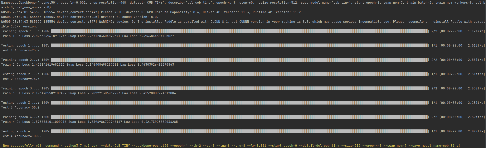
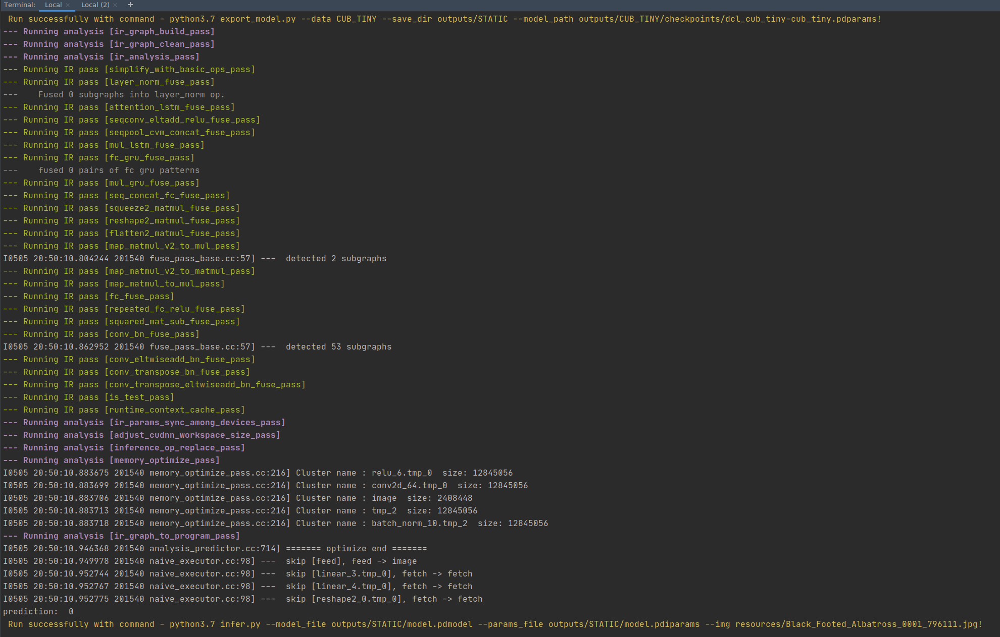

# 飞桨训推一体认证（TIPC）

## 1. 简介

飞桨除了基本的模型训练和预测，还提供了支持多端多平台的高性能推理部署工具。本文档提供了`$repo名称$`中所有模型的飞桨训推一体认证 (Training and Inference Pipeline Certification(TIPC)) 信息和测试工具，方便用户查阅每种模型的训练推理部署打通情况，并可以进行一键测试。

<div align="center">
    
</div>
## 2. 测试工具简介

### 2.1 目录介绍

```
test_tipc/
├── configs/    # 配置文件目录
    ├── DCLNet  # DCLNet模型的测试配置文件目录 
        ├── train_infer_python.txt      # 基础训练推理测试配置文件
├──docs         # 文档目录
    ├── test_train_inference_python.md  # 基础训练推理测试说明文档
├── test_train_inference_python.sh      # TIPC基础训练推理测试解析脚本
├── common_func.sh                      # TIPC基础训练推理测试常用函数
└── readme.md                           # 使用文档
```

### 2.2 测试流程概述

使用本工具，可以测试不同功能的支持情况，运行要测试的功能对应的测试脚本`test_train_inference_python.sh`，结果如下图：



